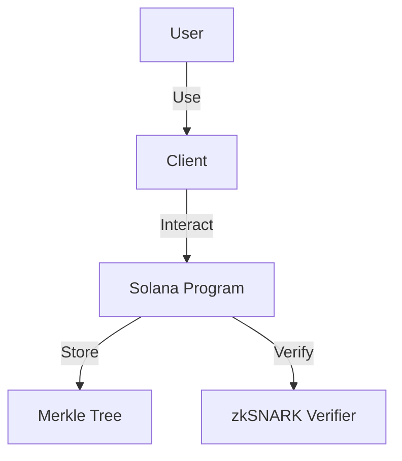

# Tornado Cash Privacy Solution for Solana

A privacy solution for Solana based on zkSNARKs. It improves transaction privacy by breaking the on-chain link between the sender and recipient addresses. It uses a Solana program that accepts SOL deposits that can be withdrawn by a different address. Whenever SOL is withdrawn by the new address, there is no way to link the withdrawal to the deposit, ensuring complete privacy.

[](https://opensource.org/licenses/MIT)
[](https://github.com/your-username/tornado-svm/actions)
[](https://your-username.github.io/tornado-svm/)

## Overview

To make a deposit, a user generates a secret and sends its hash (called a commitment) along with the deposit amount to the Tornado program. The program accepts the deposit and adds the commitment to its Merkle tree of deposits.

Later, the user decides to make a withdrawal. To do that, the user provides a zkSNARK proof that they possess a secret to an unspent commitment from the program's Merkle tree. The zkSNARK technology allows this to happen without revealing which exact deposit corresponds to this secret. The program checks the proof and transfers the deposited funds to the address specified for withdrawal. An external observer will be unable to determine which deposit this withdrawal came from.

## Features

- **Privacy**: Breaks the on-chain link between sender and recipient addresses
- **Non-custodial**: Users maintain control of their funds at all times
- **Optimized for Solana**: Designed to be efficient with Solana's compute units
- **Relayer support**: Allows third-party relayers to pay for gas fees
- **Multiple denominations**: Supports different deposit amounts

## Architecture

The system consists of the following main components:



For more details, see the [Architecture Overview](https://your-username.github.io/tornado-svm/architecture.html).

## Installation

### Prerequisites

- Rust 1.60+
- Solana CLI 1.16.0+
- Node.js 14+

### Build

```bash
# Clone the repository
git clone https://github.com/your-username/tornado-svm.git
cd tornado-svm

# Build the Solana program
cargo build-bpf

# Install the CLI tool
cd client
npm install
```

## Usage

### Initialize a Tornado Instance

```bash
# Create a new Tornado instance with a denomination of 1 SOL and a Merkle tree height of 20
npx tornado-cli initialize --denomination 1000000000 --height 20
```

### Deposit

```bash
# Generate a commitment
npx tornado-cli generate-commitment

# Deposit 1 SOL
npx tornado-cli deposit --instance <INSTANCE_ADDRESS> --commitment <COMMITMENT> --amount 1
```

### Withdraw

```bash
# Generate a proof
npx tornado-cli generate-proof --note <NOTE_PATH> --root <MERKLE_ROOT> --recipient <RECIPIENT_ADDRESS>

# Withdraw to a recipient address
npx tornado-cli withdraw --instance <INSTANCE_ADDRESS> --proof <PROOF> --root <MERKLE_ROOT> --nullifier-hash <NULLIFIER_HASH> --recipient <RECIPIENT_ADDRESS>
```

For more detailed usage instructions, see the [Quick Start Guide](https://your-username.github.io/tornado-svm/usage/quick-start.html).

## Documentation

Comprehensive documentation is available at [https://your-username.github.io/tornado-svm/](https://your-username.github.io/tornado-svm/).

The documentation includes:

- [Architecture Overview](https://your-username.github.io/tornado-svm/architecture.html)
- [Algorithms](https://your-username.github.io/tornado-svm/algorithms/)
- [Data Structures](https://your-username.github.io/tornado-svm/data-structures/)
- [Usage Guide](https://your-username.github.io/tornado-svm/usage/)
- [API Reference](https://your-username.github.io/tornado-svm/api/)
- [Development Guide](https://your-username.github.io/tornado-svm/development/)

## Security

The security of this program relies on the security of the zkSNARK implementation and the Merkle tree. The zkSNARK proofs ensure that only the owner of a commitment can withdraw the corresponding deposit, and the Merkle tree ensures that each commitment can only be spent once.

## Performance

The program is optimized for Solana's compute units:

- Deposit gas cost: ~200,000 CUs
- Withdraw gas cost: ~300,000 CUs

## Contributing

Contributions are welcome! Please feel free to submit a Pull Request.

## License

This project is licensed under the MIT License - see the [LICENSE](LICENSE) file for details.

Tornado Cash is a non-custodial Ethereum and ERC20 privacy solution based on zkSNARKs. It improves transaction privacy by breaking the on-chain link between the recipient and destination addresses. It uses a smart contract that accepts ETH deposits that can be withdrawn by a different address. Whenever ETH is withdrawn by the new address, there is no way to link the withdrawal to the deposit, ensuring complete privacy.

To make a deposit user generates a secret and sends its hash (called a commitment) along with the deposit amount to the Tornado smart contract. The contract accepts the deposit and adds the commitment to its list of deposits.

Later, the user decides to make a withdrawal. To do that, the user should provide a proof that he or she possesses a secret to an unspent commitment from the smart contract’s list of deposits. zkSnark technology allows that to happen without revealing which exact deposit corresponds to this secret. The smart contract will check the proof and transfer deposited funds to the address specified for withdrawal. An external observer will be unable to determine which deposit this withdrawal came from.

You can read more about it in [this Medium article](https://medium.com/@tornado.cash/introducing-private-transactions-on-ethereum-now-42ee915babe0)

## Specs

- Deposit gas cost: 1088354 (43381 + 50859 \* tree_depth)
- Withdraw gas cost: 301233
- Circuit Constraints = 28271 (1869 + 1325 \* tree_depth)
- Circuit Proof time = 10213ms (1071 + 347 \* tree_depth)
- Serverless


## Whitepaper

**[TornadoCash_whitepaper_v1.4.pdf](https://tornado.cash/audits/TornadoCash_whitepaper_v1.4.pdf)**

## Was it audited?

Tornado.cash protocols, circuits, and smart contracts were audited by a group of experts from [ABDK Consulting](https://www.abdk.consulting), specializing in zero-knowledge, cryptography, and smart contracts.

During the audit, no critical issues were found and all outstanding issues were fixed. The results can be found here:

- Cryptographic review https://tornado.cash/audits/TornadoCash_cryptographic_review_ABDK.pdf
- Smart contract audit https://tornado.cash/audits/TornadoCash_contract_audit_ABDK.pdf
- Zk-SNARK circuits audit https://tornado.cash/audits/TornadoCash_circuit_audit_ABDK.pdf

Underlying circomlib dependency is currently being audited, and the team already published most of the fixes for found issues

## Requirements

1. `node v11.15.0`
2. `npm install -g npx`

## Usage

You can see example usage in cli.js, it works both in the console and in the browser.

1. `npm install`
1. `cp .env.example .env`
1. `npm run build` - this may take 10 minutes or more
1. `npx ganache-cli`
1. `npm run test` - optionally runs tests. It may fail on the first try, just run it again.

Use browser version on Kovan:

1. `vi .env` - add your Kovan private key to deploy contracts
1. `npm run migrate`
1. `npx http-server` - serve current dir, you can use any other static http server
1. Open `localhost:8080`

Use the command-line version. Works for Ganache, Kovan, and Mainnet:

### Initialization

1. `cp .env.example .env`
1. `npm run download`
1. `npm run build:contract`

### Ganache

1. make sure you complete steps from Initialization
1. `ganache-cli -i 1337`
1. `npm run migrate:dev`
1. `./cli.js test`
1. `./cli.js --help`

### Kovan, Mainnet

1. Please use https://github.com/tornadocash/tornado-cli
   Reason: because tornado-core uses websnark `2041cfa5fa0b71cd5cca9022a4eeea4afe28c9f7` commit hash in order to work with local trusted setup. Tornado-cli uses `4c0af6a8b65aabea3c09f377f63c44e7a58afa6d` commit with production trusted setup of tornadoCash

Example:

```bash
./cli.js deposit ETH 0.1 --rpc https://kovan.infura.io/v3/27a9649f826b4e31a83e07ae09a87448
```

> Your note: tornado-eth-0.1-42-0xf73dd6833ccbcc046c44228c8e2aa312bf49e08389dadc7c65e6a73239867b7ef49c705c4db227e2fadd8489a494b6880bdcb6016047e019d1abec1c7652
> Tornado ETH balance is 8.9
> Sender account ETH balance is 1004873.470619891361352542
> Submitting deposit transaction
> Tornado ETH balance is 9
> Sender account ETH balance is 1004873.361652048361352542

```bash
./cli.js withdraw tornado-eth-0.1-42-0xf73dd6833ccbcc046c44228c8e2aa312bf49e08389dadc7c65e6a73239867b7ef49c705c4db227e2fadd8489a494b6880bdcb6016047e019d1abec1c7652 0x8589427373D6D84E98730D7795D8f6f8731FDA16 --rpc https://kovan.infura.io/v3/27a9649f826b4e31a83e07ae09a87448 --relayer https://kovan-frelay.duckdns.org
```

> Relay address: 0x6A31736e7490AbE5D5676be059DFf064AB4aC754
> Getting current state from tornado contract
> Generating SNARK proof
> Proof time: 9117.051ms
> Sending withdraw transaction through the relay
> Transaction submitted through the relay. View transaction on etherscan https://kovan.etherscan.io/tx/0xcb21ae8cad723818c6bc7273e83e00c8393fcdbe74802ce5d562acad691a2a7b
> Transaction mined in block 17036120
> Done

## Deploy ETH Tornado Cash

1. `cp .env.example .env`
1. Tune all necessary params
1. `npx truffle migrate --network kovan --reset --f 2 --to 4`

## Deploy ERC20 Tornado Cash

1. `cp .env.example .env`
1. Tune all necessary params
1. `npx truffle migrate --network kovan --reset --f 2 --to 3`
1. `npx truffle migrate --network kovan --reset --f 5`

**Note**. If you want to reuse the same verifier for all the instances, then after you deployed one of the instances you should only run the 4th or 5th migration for ETH or ERC20 contracts respectively (`--f 4 --to 4` or `--f 5`).

## How to resolve ENS name to DNS name for a relayer

1. Visit https://etherscan.io/enslookup and put relayer ENS name to the form.
2. Copy the namehash (1) and click on the `Resolver` link (2)
   
3. Go to the `Contract` tab. Click on `Read Contract` and scroll down to the `5. text` method.
4. Put the values:
   
5. Click `Query` and you will get the DNS name. Just add `https://` to it and use it as `relayer url`

## Credits

Special thanks to @barryWhiteHat and @kobigurk for valuable input,
and @jbaylina for awesome [Circom](https://github.com/iden3/circom) & [Websnark](https://github.com/iden3/websnark) framework

## Minimal demo example

1. `npm i`
1. `ganache-cli -d`
1. `npm run download`
1. `npm run build:contract`
1. `cp .env.example .env`
1. `npm run migrate:dev`
1. `node minimal-demo.js`

## Run tests/coverage

Prepare test environment:

```
   yarn install
   yarn download
   cp .env.example .env
   npx ganache-cli > /dev/null &
   npm run migrate:dev
```

Run tests:

```
   yarn test
```

Run coverage:

```
   yarn coverage
```

## Emulate MPC trusted setup ceremony

```bash
cargo install zkutil
npx circom circuits/withdraw.circom -o build/circuits/withdraw.json
zkutil setup -c build/circuits/withdraw.json -p build/circuits/withdraw.params
zkutil export-keys -c build/circuits/withdraw.json -p build/circuits/withdraw.params -r build/circuits/withdraw_proving_key.json -v build/circuits/withdraw_verification_key.json
zkutil generate-verifier -p build/circuits/withdraw.params -v build/circuits/Verifier.sol
sed -i -e 's/pragma solidity \^0.6.0/pragma solidity 0.5.17/g' ./build/circuits/Verifier.sol
```