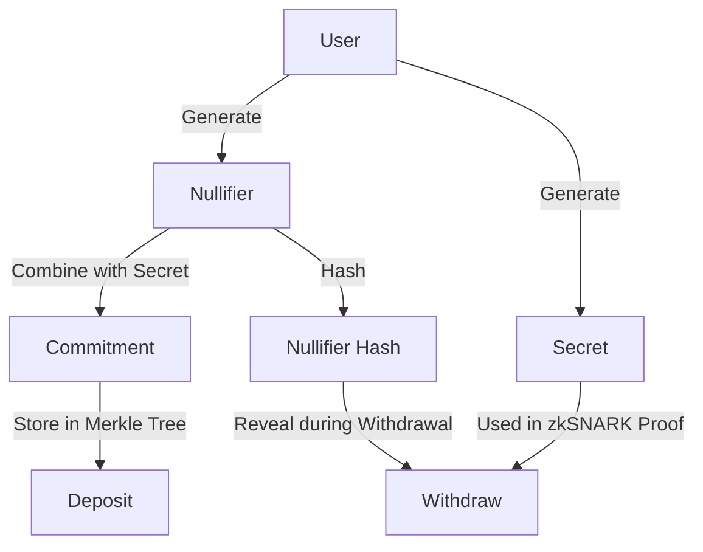
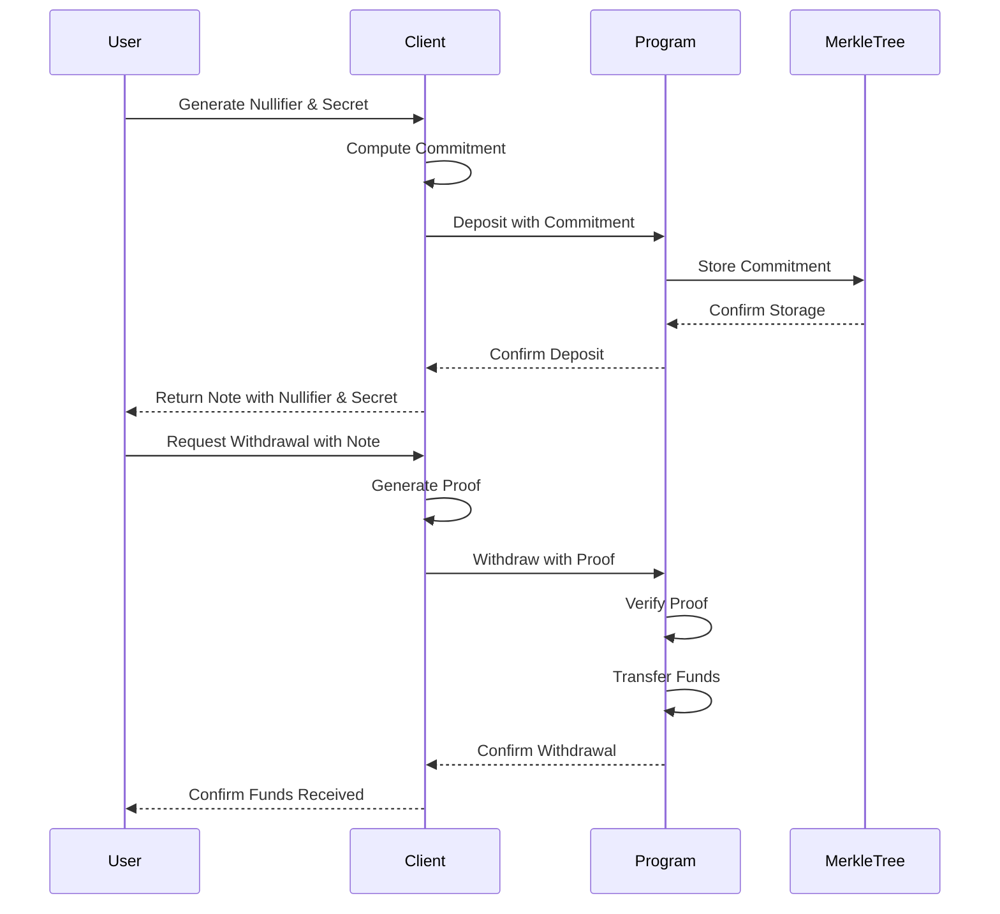

# Commitment Generation

Commitments are a fundamental component of the Tornado Cash Privacy Solution for Solana. They allow users to commit to a value (their deposit) without revealing it, and later prove that they know the value without revealing which specific commitment they are proving. This page explains how commitments are generated and used in the system.

## Overview

A commitment is a cryptographic hash of a nullifier and a secret. The nullifier is a random value that is used to prevent double-spending, and the secret is a random value that is used to hide the nullifier. When a user makes a deposit, they generate a commitment and send it to the Tornado Cash program, which adds it to the Merkle tree. Later, when the user wants to withdraw, they prove that they know the nullifier and secret corresponding to a commitment in the Merkle tree without revealing which commitment it is.



## Commitment Generation

When a user wants to make a deposit, they first generate a random nullifier and a random secret. These are 32-byte random values that should be kept secret.

```javascript
// Generate a random commitment
function generateCommitment() {
  const nullifier = crypto.randomBytes(32);
  const secret = crypto.randomBytes(32);
  
  // Compute commitment (in a real implementation, this would use Pedersen hash)
  const commitment = crypto.createHash('sha256')
    .update(Buffer.concat([nullifier, secret]))
    .digest();
  
  // Save the note
  const note = {
    nullifier: nullifier.toString('hex'),
    secret: secret.toString('hex'),
    commitment: commitment.toString('hex')
  };
  
  return { note, commitment };
}
```

In the Rust implementation, the commitment is computed as follows:

```rust
/// Compute the Pedersen hash of a nullifier and secret
/// This is a simplified implementation using Keccak256
pub fn compute_commitment(nullifier: &[u8; 32], secret: &[u8; 32]) -> [u8; 32] {
    use sha3::{Digest, Keccak256};
    
    let mut hasher = Keccak256::new();
    hasher.update(nullifier);
    hasher.update(secret);
    let result = hasher.finalize();
    
    let mut commitment = [0u8; 32];
    commitment.copy_from_slice(&result[..32]);
    
    commitment
}
```

## Commitment Usage

The commitment is used in the following ways:

1. **During Deposit**: The commitment is sent to the Tornado Cash program, which adds it to the Merkle tree.
2. **During Withdrawal**: The user proves that they know the nullifier and secret corresponding to a commitment in the Merkle tree without revealing which commitment it is.



## Commitment Registry

The Tornado Cash program maintains a registry of commitments in the Merkle tree. When a user makes a deposit, the program checks if the commitment already exists to prevent duplicate deposits.

```rust
/// Check if a commitment exists in the commitments array
pub fn commitment_exists(commitments: &[[u8; 32]], commitment: &[u8; 32]) -> bool {
    commitments.iter().any(|c| c == commitment)
}

/// Add a commitment to the commitments array
pub fn add_commitment(commitments: &mut Vec<[u8; 32]>, commitment: &[u8; 32]) -> ProgramResult {
    if commitment_exists(commitments, commitment) {
        return Err(TornadoError::CommitmentAlreadyExists.into());
    }
    commitments.push(*commitment);
    Ok(())
}
```

## Security Considerations

The security of the commitment mechanism relies on several properties:

1. **Binding**: It should be computationally infeasible to find two different (nullifier, secret) pairs that produce the same commitment.
2. **Hiding**: Given a commitment, it should be computationally infeasible to find the corresponding nullifier and secret.
3. **Randomness**: The nullifier and secret should be generated using a secure random number generator to ensure unpredictability.

## Performance Considerations

The commitment generation is designed to be efficient:

1. **Compute Units**: The hash function is optimized to minimize compute unit usage.
2. **Storage**: The commitment registry is designed to minimize account storage costs.
3. **Verification**: The commitment check is a simple lookup operation, which is efficient.

## Conclusion

The commitment mechanism is a critical component of the Tornado Cash Privacy Solution for Solana. It allows users to commit to a value without revealing it, and later prove that they know the value without revealing which specific commitment they are proving. This is essential for the privacy and security of the system.