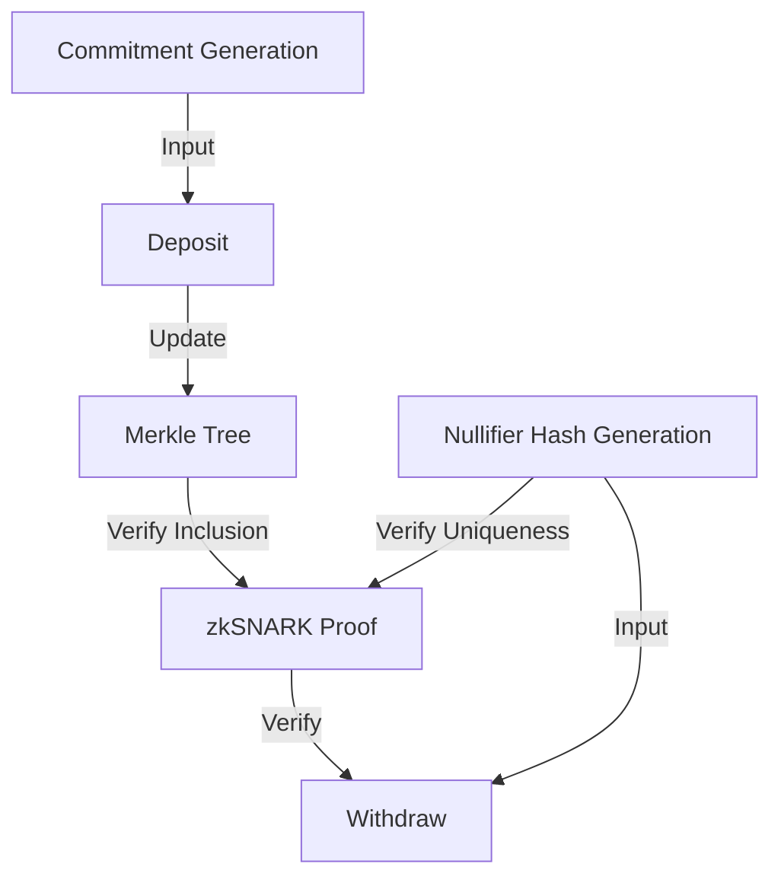

# Algorithms

This section provides detailed explanations of the key algorithms used in the Tornado Cash Privacy Solution for Solana.

## Core Algorithms

The system relies on several key algorithms to provide privacy and security:

1. [Merkle Tree](merkle-tree.md): Used to efficiently store and verify commitments
2. [zkSNARK Verification](zksnarks.md): Enables zero-knowledge proofs for private withdrawals
3. [Nullifier Hash Generation](nullifier-hash.md): Prevents double-spending of commitments
4. [Commitment Generation](commitment-generation.md): Creates secure commitments for deposits

## Algorithm Interactions

The algorithms interact with each other to provide the complete privacy solution:

## Performance Considerations

The algorithms are optimized for Solana's performance characteristics:

1. **Compute Units**: Operations are optimized to minimize compute unit usage
2. **Account Storage**: Data structures are designed to minimize account storage costs
3. **Parallelization**: The algorithms leverage Solana's parallel transaction processing

## Security Considerations

The security of the system relies on the security of these algorithms:

1. **Merkle Tree**: Provides efficient and secure storage of commitments
2. **zkSNARKs**: Enables zero-knowledge proofs for private withdrawals
3. **Nullifier Hashes**: Prevents double-spending of commitments
4. **Commitment Generation**: Ensures the security of deposits