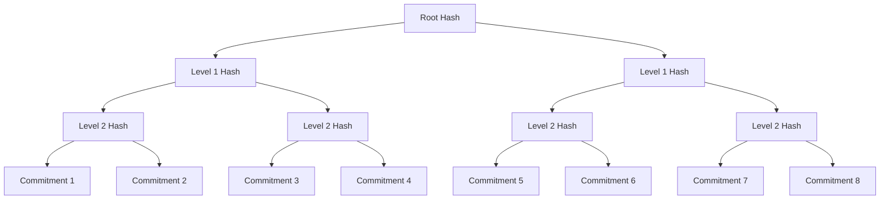
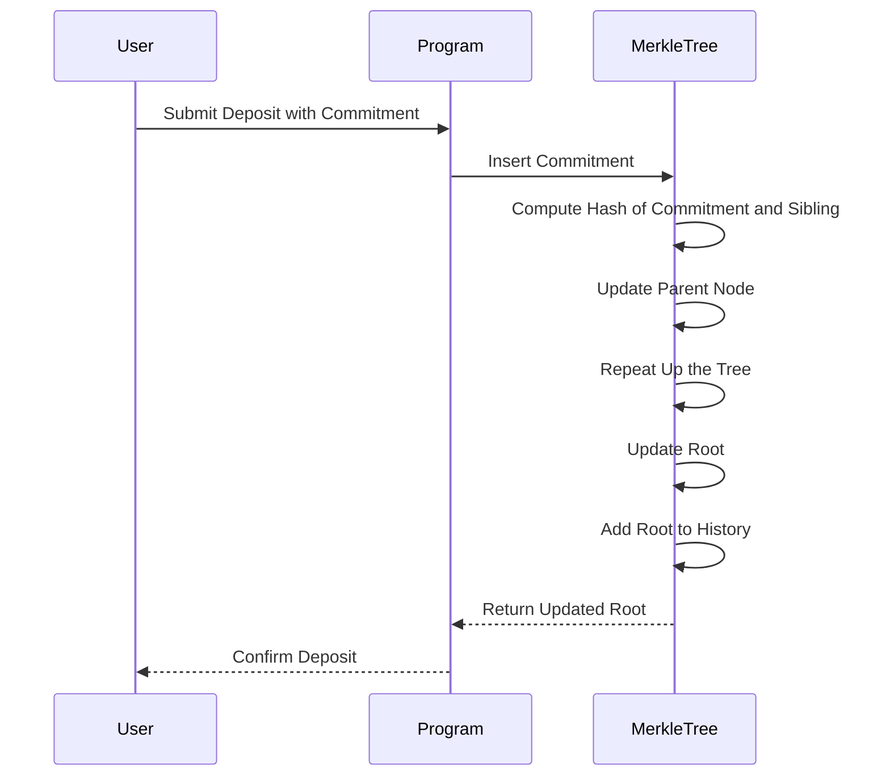
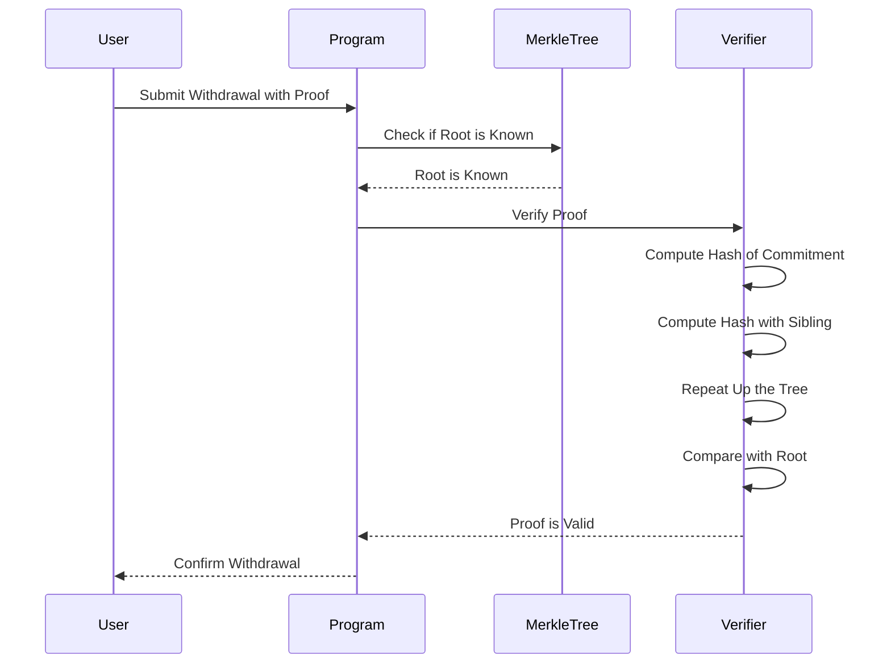

# Merkle Tree Implementation

The Merkle tree is a fundamental data structure in the Tornado Cash Privacy Solution for Solana. It allows for efficient storage and verification of commitments, which is essential for the privacy and security of the system.

## Overview

A Merkle tree is a binary tree where each leaf node contains a hash of a data block, and each non-leaf node contains a hash of its two child nodes. This structure allows for efficient verification of the inclusion of a data block in the tree.

In the context of Tornado Cash, the Merkle tree is used to store commitments (hashes of user secrets) and provide efficient proofs that a commitment is included in the tree without revealing which specific commitment is being proven.

## Structure

The Merkle tree implementation in Tornado Cash for Solana has the following structure:



The tree has a fixed height, which determines the maximum number of commitments that can be stored. For example, a tree with height 20 can store up to 2^20 (approximately 1 million) commitments.

## Key Components

### Zero Values

Each level of the tree has a "zero value" that is used to fill in empty nodes. The zero value at level 0 (the leaf level) is a hash of the string "tornado". The zero values for higher levels are computed by hashing the zero values of the level below.

```rust
/// Zero value for the Merkle tree (keccak256("tornado") % FIELD_SIZE)
pub const ZERO_VALUE: [u8; 32] = [
    0x2f, 0xe5, 0x4c, 0x60, 0xd3, 0xac, 0xab, 0xf3, 0x34, 0x3a, 0x35, 0xb6, 0xeb, 0xa1, 0x5d, 0xb4,
    0x82, 0x1b, 0x34, 0x0f, 0x76, 0xe7, 0x41, 0xe2, 0x24, 0x96, 0x85, 0xed, 0x48, 0x99, 0xaf, 0x6c,
];
```

### Filled Subtrees

The Merkle tree maintains a "filled subtrees" array, which stores the rightmost node at each level of the tree. This allows for efficient updates when new commitments are added.

### Root History

The Merkle tree maintains a history of roots, which allows for withdrawals to be made using older versions of the tree. This is important because it allows users to make withdrawals even if new deposits have been added to the tree since they made their deposit.

## Operations

### Hashing

The Merkle tree uses a hash function to compute the hash of each node. In the Tornado Cash implementation, this is a variant of the Keccak-256 hash function that ensures the result is within the BN254 field.

```rust
/// Computes the hash of two leaves in the Merkle tree
pub fn hash_left_right(left: &[u8; 32], right: &[u8; 32]) -> Result<[u8; 32], ProgramError> {
    // Ensure inputs are within the field
    if !is_within_field(left) || !is_within_field(right) {
        return Err(TornadoError::InvalidMerkleTreeState.into());
    }

    // Compute MiMC(left, right) using Keccak256 as a substitute
    // In a real implementation, we would use MiMC or another zkSNARK-friendly hash function
    let mut hasher = Keccak256::new();
    hasher.update(left);
    hasher.update(right);
    let result = hasher.finalize();
    
    // Convert to array and ensure it's within the field
    let mut hash = [0u8; 32];
    hash.copy_from_slice(&result[..32]);
    
    // Ensure the result is within the field
    if !is_within_field(&hash) {
        // If not, take the result modulo the field size
        hash = mod_field_size(&hash);
    }
    
    Ok(hash)
}
```

### Insertion

When a new commitment is added to the tree, it is inserted as a leaf node, and the tree is updated from the bottom up. The process is as follows:

1. The commitment is inserted as a leaf node at the next available position.
2. The hash of the new leaf node and its sibling (or a zero value if there is no sibling) is computed.
3. This hash becomes the value of the parent node.
4. The process is repeated up the tree until the root is reached.
5. The new root is added to the root history.



The insertion algorithm is implemented as follows:

```rust
/// Insert a leaf into the Merkle tree
pub fn insert_leaf(
    leaf: &[u8; 32],
    current_index: u32,
    next_index: u32,
    height: u8,
    filled_subtrees: &mut [[u8; 32]],
    roots: &mut [[u8; 32]; ROOT_HISTORY_SIZE],
    current_root_index: &mut u8,
) -> Result<u32, ProgramError> {
    // Check if the tree is full
    if next_index >= 2u32.pow(height as u32) {
        return Err(TornadoError::MerkleTreeFull.into());
    }
    
    let mut current_idx = next_index;
    let mut current_level_hash = *leaf;
    
    // Update the tree
    for i in 0..height as usize {
        let left: [u8; 32];
        let right: [u8; 32];
        
        if current_idx % 2 == 0 {
            // If current_idx is even, the leaf is on the left
            left = current_level_hash;
            right = get_zero_value(i);
            filled_subtrees[i] = current_level_hash;
        } else {
            // If current_idx is odd, the leaf is on the right
            left = filled_subtrees[i];
            right = current_level_hash;
        }
        
        // Hash the left and right nodes
        current_level_hash = hash_left_right(&left, &right)?;
        current_idx /= 2;
    }
    
    // Update the root
    let new_root_index = (*current_root_index as usize + 1) % ROOT_HISTORY_SIZE;
    *current_root_index = new_root_index as u8;
    roots[new_root_index] = current_level_hash;
    
    Ok(next_index)
}
```

### Verification

To verify that a commitment is included in the tree, a Merkle proof is used. A Merkle proof consists of the sibling nodes along the path from the leaf to the root. The verification process is as follows:

1. The hash of the commitment is computed.
2. The hash of this value and its sibling (from the proof) is computed.
3. This process is repeated up the tree, using the siblings from the proof.
4. The resulting root hash is compared to the known root hash.
5. If they match, the commitment is verified to be in the tree.



The verification of a known root is implemented as follows:

```rust
/// Check if a root is in the root history
pub fn is_known_root(
    root: &[u8; 32],
    roots: &[[u8; 32]; ROOT_HISTORY_SIZE],
    current_root_index: u8,
) -> bool {
    // Check if the root is zero
    if root.iter().all(|&x| x == 0) {
        return false;
    }
    
    let mut i = current_root_index as usize;
    loop {
        if root == &roots[i] {
            return true;
        }
        
        if i == 0 {
            i = ROOT_HISTORY_SIZE - 1;
        } else {
            i -= 1;
        }
        
        if i == current_root_index as usize {
            break;
        }
    }
    
    false
}
```

## Performance Considerations

The Merkle tree implementation is optimized for Solana's performance characteristics:

1. **Compute Units**: The hash function and tree operations are optimized to minimize compute unit usage.
2. **Account Storage**: The tree structure is designed to minimize account storage costs.
3. **Parallelization**: The tree operations can be parallelized to leverage Solana's parallel transaction processing.

## Security Considerations

The security of the Merkle tree relies on the security of the hash function used. In the Tornado Cash implementation, a variant of the Keccak-256 hash function is used, which is considered secure.

The tree also maintains a history of roots, which allows for withdrawals to be made using older versions of the tree. This is important for security, as it prevents front-running attacks where an attacker could add a new commitment to the tree before a user's withdrawal is processed.

## Conclusion

The Merkle tree is a critical component of the Tornado Cash Privacy Solution for Solana. It provides efficient storage and verification of commitments, which is essential for the privacy and security of the system.