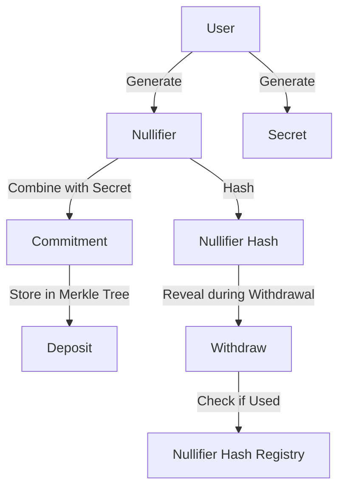
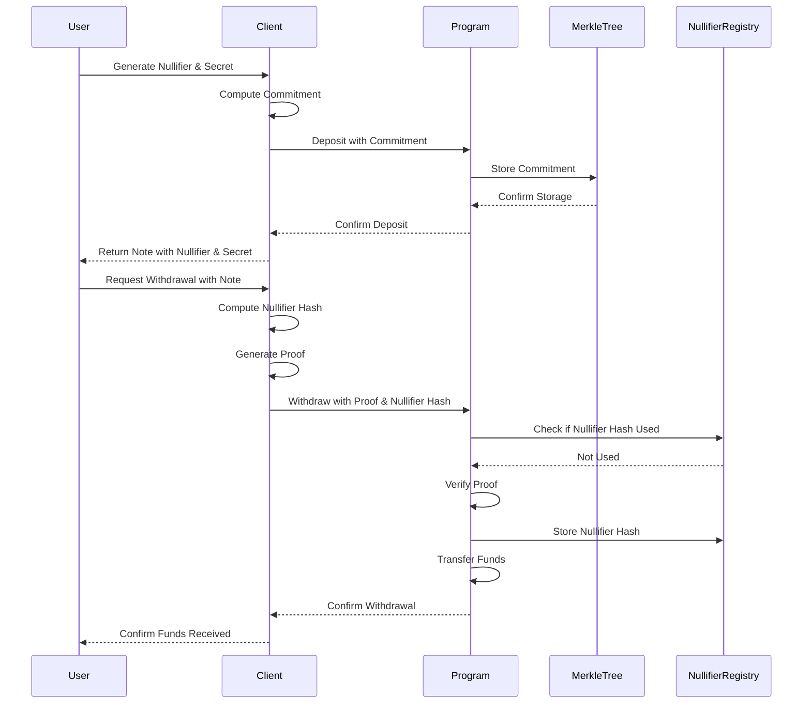

# Nullifier Hash Generation

Nullifier hashes are a critical component of the Tornado Cash Privacy Solution for Solana. They prevent double-spending of commitments while maintaining privacy. This page explains how nullifier hashes are generated and used in the system.

## Overview

A nullifier is a random value that is used to create a commitment. When a user wants to withdraw funds, they reveal the nullifier hash (but not the nullifier itself) to prove that they are the owner of the commitment without revealing which commitment it is. The nullifier hash is then stored in the contract to prevent double-spending.



## Nullifier Generation

When a user wants to make a deposit, they first generate a random nullifier. This is a 32-byte random value that should be kept secret.

```javascript
// Generate a random nullifier
function generateNullifier() {
  return crypto.randomBytes(32);
}
```

## Nullifier Hash Computation

The nullifier hash is computed by applying a cryptographic hash function to the nullifier. In the Tornado Cash implementation, this is a variant of the Keccak-256 hash function that ensures the result is within the BN254 field.

```rust
/// Compute the hash of a nullifier
/// This is a simplified implementation using Keccak256
pub fn compute_nullifier_hash(nullifier: &[u8; 32]) -> [u8; 32] {
    use sha3::{Digest, Keccak256};
    
    let mut hasher = Keccak256::new();
    hasher.update(nullifier);
    let result = hasher.finalize();
    
    let mut nullifier_hash = [0u8; 32];
    nullifier_hash.copy_from_slice(&result[..32]);
    
    nullifier_hash
}
```

In the JavaScript client, the nullifier hash is computed as follows:

```javascript
// Compute nullifier hash
const nullifierHash = crypto.createHash('sha256')
  .update(Buffer.from(note.nullifier, 'hex'))
  .digest();
```

## Nullifier Hash Usage

The nullifier hash is used in the following ways:

1. **During Deposit**: The nullifier is combined with a secret to create a commitment, which is stored in the Merkle tree.
2. **During Withdrawal**: The nullifier hash is revealed to prove ownership of the commitment without revealing which commitment it is.
3. **After Withdrawal**: The nullifier hash is stored in the contract to prevent double-spending.



## Nullifier Hash Registry

The Tornado Cash program maintains a registry of used nullifier hashes to prevent double-spending. When a user attempts to withdraw funds, the program checks if the nullifier hash has already been used.

```rust
/// Check if a nullifier hash exists in the nullifier_hashes array
pub fn nullifier_hash_exists(nullifier_hashes: &[[u8; 32]], nullifier_hash: &[u8; 32]) -> bool {
    nullifier_hashes.iter().any(|n| n == nullifier_hash)
}

/// Add a nullifier hash to the nullifier_hashes array
pub fn add_nullifier_hash(nullifier_hashes: &mut Vec<[u8; 32]>, nullifier_hash: &[u8; 32]) -> ProgramResult {
    if nullifier_hash_exists(nullifier_hashes, nullifier_hash) {
        return Err(TornadoError::NullifierAlreadySpent.into());
    }
    nullifier_hashes.push(*nullifier_hash);
    Ok(())
}
```

## Security Considerations

The security of the nullifier hash mechanism relies on several properties:

1. **Collision Resistance**: It should be computationally infeasible to find two different nullifiers that produce the same nullifier hash.
2. **Pre-image Resistance**: Given a nullifier hash, it should be computationally infeasible to find the corresponding nullifier.
3. **Randomness**: The nullifier should be generated using a secure random number generator to ensure unpredictability.

## Performance Considerations

The nullifier hash computation is designed to be efficient:

1. **Compute Units**: The hash function is optimized to minimize compute unit usage.
2. **Storage**: The nullifier hash registry is designed to minimize account storage costs.
3. **Verification**: The nullifier hash check is a simple lookup operation, which is efficient.

## Conclusion

The nullifier hash mechanism is a critical component of the Tornado Cash Privacy Solution for Solana. It prevents double-spending of commitments while maintaining privacy, which is essential for the security and privacy of the system.