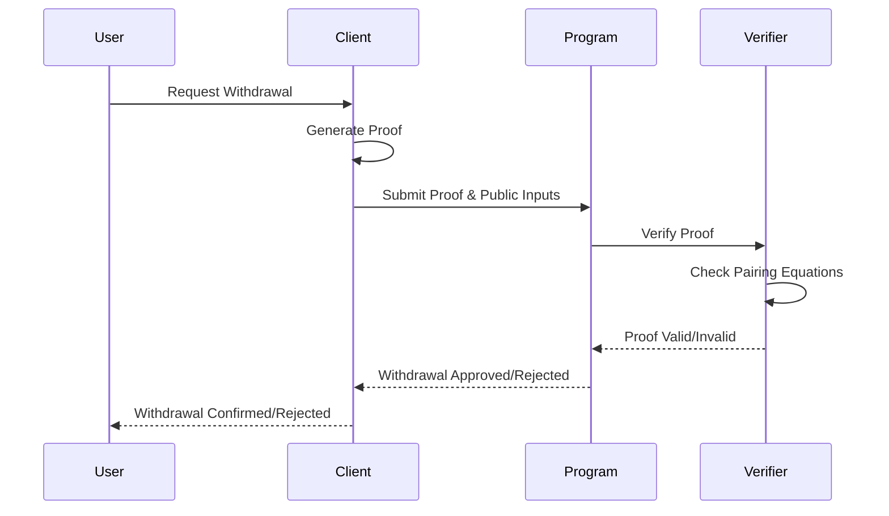
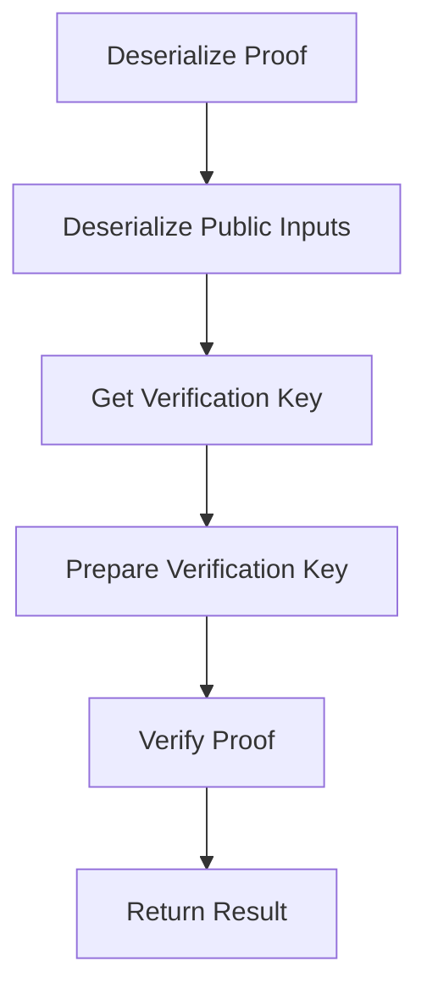

# zkSNARK Verification

Zero-Knowledge Succinct Non-Interactive Arguments of Knowledge (zkSNARKs) are a form of cryptographic proof that allows one party (the prover) to prove to another party (the verifier) that a statement is true, without revealing any information beyond the validity of the statement itself. In the context of Tornado Cash, zkSNARKs are used to prove that a user knows a secret corresponding to a commitment in the Merkle tree, without revealing which commitment it is.

## Overview

The zkSNARK verification process in Tornado Cash for Solana involves the following steps:

1. The user (prover) generates a proof that they know a secret corresponding to a commitment in the Merkle tree.
2. The proof is submitted to the Solana program along with public inputs.
3. The program verifies the proof using the zkSNARK verification algorithm.
4. If the proof is valid, the program allows the withdrawal.



## zkSNARK Components

### Proving Key

The proving key is used by the prover to generate a proof. It contains the parameters needed to create a proof for a specific circuit. In the Tornado Cash implementation, the proving key is generated during a trusted setup ceremony and is used by the client to generate proofs.

### Verification Key

The verification key is used by the verifier to check the validity of a proof. It contains the parameters needed to verify a proof for a specific circuit. In the Tornado Cash implementation, the verification key is hardcoded in the Solana program.

```rust
/// Get the hardcoded verifying key
fn get_verifying_key() -> Result<VerifyingKey<Bn254>, ProgramError> {
    // This would be the hardcoded verifying key from the trusted setup
    // For simplicity, we're creating a dummy key here
    // In a real implementation, this would be the actual verifying key
    
    // Alpha in G1
    let alpha_g1 = G1Affine::new(
        Fr::from(1),
        Fr::from(2),
    );
    
    // Beta in G2
    let beta_g2 = G2Affine::new(
        [Fr::from(3), Fr::from(4)],
        [Fr::from(5), Fr::from(6)],
    );
    
    // Gamma in G2
    let gamma_g2 = G2Affine::new(
        [Fr::from(7), Fr::from(8)],
        [Fr::from(9), Fr::from(10)],
    );
    
    // Delta in G2
    let delta_g2 = G2Affine::new(
        [Fr::from(11), Fr::from(12)],
        [Fr::from(13), Fr::from(14)],
    );
    
    // IC (7 elements for 6 public inputs + 1)
    let mut ic = Vec::with_capacity(7);
    for i in 0..7 {
        ic.push(G1Affine::new(
            Fr::from((i * 2 + 15) as u64),
            Fr::from((i * 2 + 16) as u64),
        ));
    }
    
    Ok(VerifyingKey {
        alpha_g1,
        beta_g2,
        gamma_g2,
        delta_g2,
        gamma_abc_g1: ic,
    })
}
```

### Proof

A proof is a set of cryptographic elements that, when verified with the verification key, prove that the prover knows a secret corresponding to a commitment in the Merkle tree. In the Tornado Cash implementation, a proof consists of three elements: `a`, `b`, and `c`.

```rust
/// Deserialize a proof from bytes
fn deserialize_proof(proof_data: &[u8]) -> Result<Proof<Bn254>, ProgramError> {
    // Ensure the proof data is the correct length
    if proof_data.len() != 256 {
        msg!("Invalid proof data length: {}", proof_data.len());
        return Err(TornadoError::InvalidProof.into());
    }
    
    // Extract the proof components
    let a_x = extract_field_element(&proof_data[0..32])?;
    let a_y = extract_field_element(&proof_data[32..64])?;
    let b_x_1 = extract_field_element(&proof_data[64..96])?;
    let b_x_2 = extract_field_element(&proof_data[96..128])?;
    let b_y_1 = extract_field_element(&proof_data[128..160])?;
    let b_y_2 = extract_field_element(&proof_data[160..192])?;
    let c_x = extract_field_element(&proof_data[192..224])?;
    let c_y = extract_field_element(&proof_data[224..256])?;
    
    // Create the G1 and G2 points
    let a = G1Affine::new(a_x, a_y);
    let b = G2Affine::new([b_x_1, b_x_2], [b_y_1, b_y_2]);
    let c = G1Affine::new(c_x, c_y);
    
    // Create the proof
    Ok(Proof { a, b, c })
}
```

### Public Inputs

Public inputs are values that are known to both the prover and the verifier. In the Tornado Cash implementation, the public inputs include:

1. The Merkle root
2. The nullifier hash
3. The recipient address
4. The relayer address
5. The fee
6. The refund amount

```rust
/// Deserialize public inputs from bytes
fn deserialize_public_inputs(data: &[u8; 192]) -> Result<Vec<Fr>, ProgramError> {
    let mut inputs = Vec::with_capacity(6);
    
    for i in 0..6 {
        let start = i * 32;
        let end = start + 32;
        let input = extract_field_element(&data[start..end])?;
        inputs.push(input);
    }
    
    Ok(inputs)
}
```

## Verification Algorithm

The zkSNARK verification algorithm checks if a proof is valid for a given set of public inputs. The algorithm involves checking a set of pairing equations using elliptic curve pairings.



The verification process is implemented as follows:

```rust
/// Verifies a zkSNARK proof
pub fn verify_tornado_proof(
    proof_data: &[u8],
    public_inputs: &[u8; 192], // 6 public inputs * 32 bytes
) -> Result<bool, ProgramError> {
    // Deserialize the proof
    let proof = deserialize_proof(proof_data)?;
    
    // Deserialize the public inputs
    let inputs = deserialize_public_inputs(public_inputs)?;
    
    // Get the hardcoded verifying key
    let vk = get_verifying_key()?;
    
    // Prepare the verifying key
    let pvk = prepare_verifying_key(&vk);
    
    // Verify the proof
    let result = verify_proof(&pvk, &proof, &inputs);
    
    match result {
        Ok(valid) => {
            if valid {
                msg!("Proof verification successful");
                Ok(true)
            } else {
                msg!("Proof verification failed");
                Err(TornadoError::InvalidProof.into())
            }
        }
        Err(e) => {
            msg!("Error verifying proof: {:?}", e);
            Err(TornadoError::InvalidProof.into())
        }
    }
}
```

## Circuit Design

The zkSNARK circuit used in Tornado Cash is designed to prove the following statement:

"I know a secret and nullifier such that:
1. The commitment = hash(nullifier, secret)
2. The commitment is in the Merkle tree with root R
3. The nullifier hash = hash(nullifier)
4. I want to withdraw to recipient address A
5. I want to pay a fee of F to relayer address B
6. I want a refund of amount E"

The circuit is implemented using the circom language and compiled to a zkSNARK circuit. The circuit includes constraints for:

1. Computing the commitment from the nullifier and secret
2. Verifying the Merkle path from the commitment to the root
3. Computing the nullifier hash from the nullifier
4. Ensuring the recipient, relayer, fee, and refund values match the public inputs

## Performance Considerations

The zkSNARK verification algorithm is computationally intensive, but it is designed to be efficient:

1. **Proof Size**: The proof is compact (256 bytes), which minimizes transaction size.
2. **Verification Time**: The verification algorithm is optimized to minimize compute unit usage.
3. **Public Input Size**: The public inputs are minimized to reduce transaction size.

## Security Considerations

The security of the zkSNARK verification algorithm relies on several cryptographic assumptions:

1. **Discrete Logarithm Assumption**: It should be computationally infeasible to find the discrete logarithm of a random element in a group.
2. **Knowledge of Exponent Assumption**: If an adversary can compute a pair (g^a, h^a) for random g and h, then they must know a.
3. **Trusted Setup**: The parameters for the zkSNARK must be generated in a secure way, typically through a multi-party computation ceremony.

## Conclusion

The zkSNARK verification algorithm is a critical component of the Tornado Cash Privacy Solution for Solana. It allows users to prove that they know a secret corresponding to a commitment in the Merkle tree, without revealing which commitment it is. This enables private transactions on the Solana blockchain.