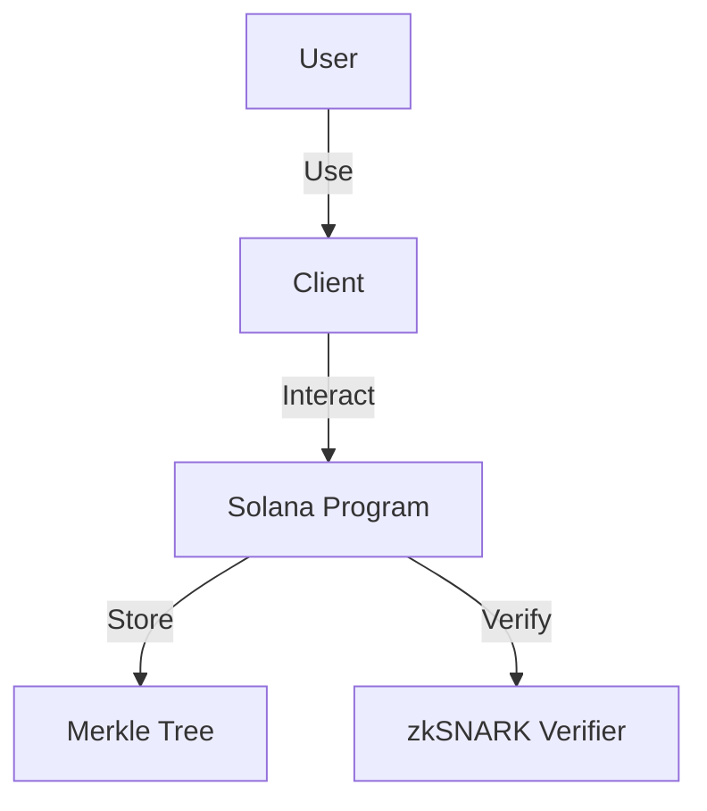
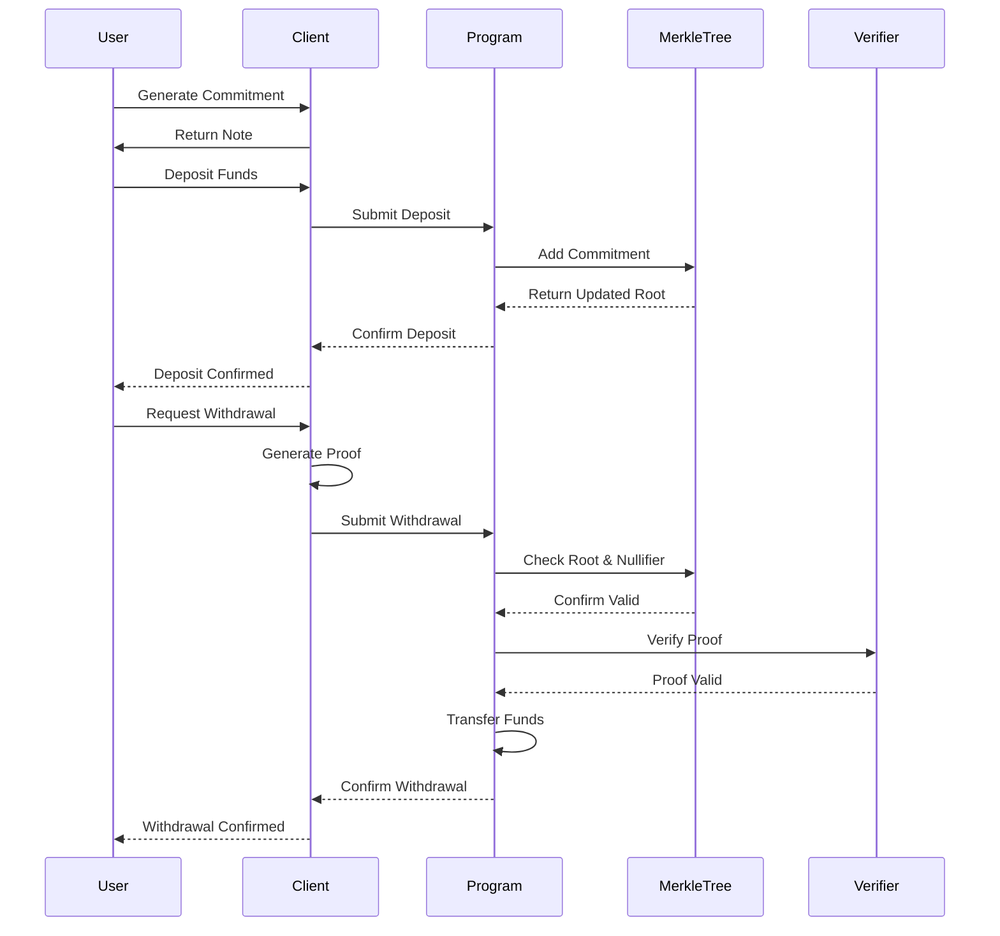
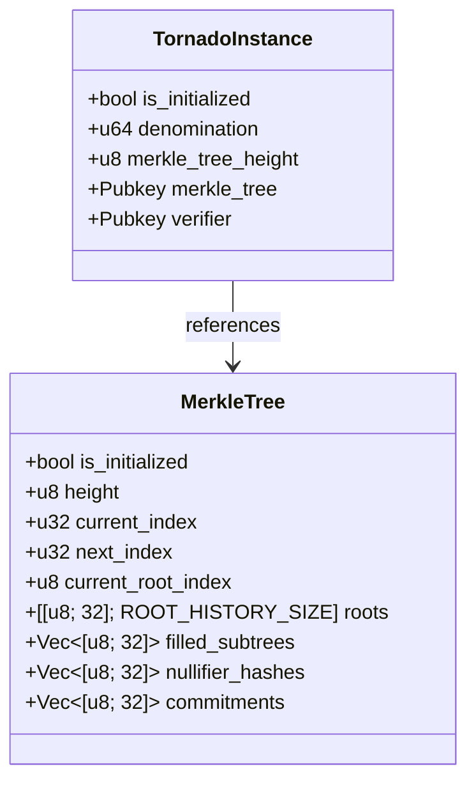

# Architecture Overview

The Tornado Cash Privacy Solution for Solana is designed with a modular architecture that separates concerns and ensures maintainability. This page provides an overview of the system architecture, including the main components and their interactions.

## System Components

The system consists of the following main components:

### Solana Program

The core of the system is a Solana program that handles deposits and withdrawals. The program is responsible for:

- Accepting deposits and storing commitments in a Merkle tree
- Verifying zkSNARK proofs for withdrawals
- Transferring funds to recipients upon successful verification

### Merkle Tree

The Merkle tree is a data structure used to efficiently store and verify commitments. It allows the program to:

- Store a large number of commitments in a space-efficient manner
- Provide cryptographic proofs of inclusion for withdrawals
- Maintain a history of roots to support withdrawals from older deposits

### zkSNARK Verifier

The zkSNARK verifier is responsible for verifying zero-knowledge proofs. It ensures that:

- The user knows the secret corresponding to a commitment in the Merkle tree
- The commitment has not been spent before (using nullifier hashes)
- The withdrawal is authorized without revealing which deposit is being withdrawn

### Client

The client is a JavaScript library and CLI tool that allows users to interact with the Tornado Cash program. It provides functionality for:

- Generating commitments and notes
- Creating deposits
- Generating zkSNARK proofs for withdrawals
- Submitting withdrawals

## Data Flow

The data flow in the system is as follows:

## Account Structure

The Solana program uses the following account structure:

## Security Considerations

The security of the system relies on several cryptographic primitives:

1. **Merkle Tree**: Provides efficient and secure storage of commitments
2. **zkSNARKs**: Enables zero-knowledge proofs for private withdrawals
3. **Nullifier Hashes**: Prevents double-spending of commitments
4. **Solana's Account Model**: Ensures secure storage and access control

## Performance Considerations

The system is optimized for Solana's performance characteristics:

1. **Compute Units**: Operations are optimized to minimize compute unit usage
2. **Account Storage**: Data structures are designed to minimize account storage costs
3. **Parallelization**: The system leverages Solana's parallel transaction processing

## Next Steps

For more detailed information about specific components, see:

- [Merkle Tree Implementation](algorithms/merkle-tree.md)
- [zkSNARK Verification](algorithms/zksnarks.md)
- [Account Structure](data-structures/accounts.md)