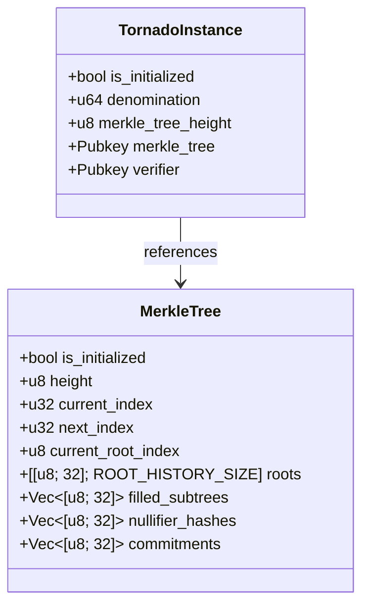
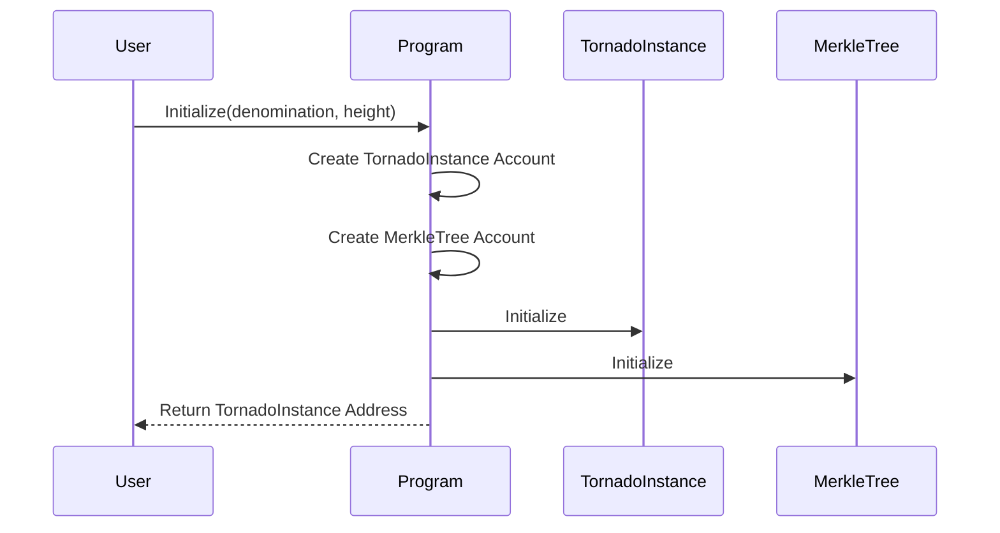

# Account Structures

The Tornado Cash Privacy Solution for Solana uses several account structures to store state and manage the privacy protocol. This page provides detailed information about these account structures.

## Overview

Solana uses an account-based model, where each account is owned by a program and contains data that the program can modify. The Tornado Cash program uses several account types to store state and manage the privacy protocol.



## TornadoInstance Account

The `TornadoInstance` account represents a single instance of the Tornado Cash protocol. Each instance has a specific denomination and Merkle tree height.

```rust
/// Tornado instance state
#[derive(BorshSerialize, BorshDeserialize, Debug, Default, PartialEq)]
pub struct TornadoInstance {
    /// Is the instance initialized
    pub is_initialized: bool,
    /// The denomination amount for this instance
    pub denomination: u64,
    /// The height of the Merkle tree
    pub merkle_tree_height: u8,
    /// The Merkle tree account
    pub merkle_tree: Pubkey,
    /// The verifier account
    pub verifier: Pubkey,
}
```

### Fields

- **is_initialized**: A boolean flag indicating whether the instance has been initialized.
- **denomination**: The amount of SOL (in lamports) that can be deposited and withdrawn from this instance.
- **merkle_tree_height**: The height of the Merkle tree used to store commitments.
- **merkle_tree**: The public key of the Merkle tree account associated with this instance.
- **verifier**: The public key of the verifier account associated with this instance.

### Account Size

The size of the `TornadoInstance` account is fixed at 74 bytes:

```rust
impl Pack for TornadoInstance {
    const LEN: usize = 1 + 8 + 1 + 32 + 32; // is_initialized + denomination + merkle_tree_height + merkle_tree + verifier

    fn unpack_from_slice(src: &[u8]) -> Result<Self, ProgramError> {
        let instance = Self::try_from_slice(src)?;
        Ok(instance)
    }

    fn pack_into_slice(&self, dst: &mut [u8]) {
        let data = self.try_to_vec().unwrap();
        dst[..data.len()].copy_from_slice(&data);
    }
}
```

## MerkleTree Account

The `MerkleTree` account stores the state of the Merkle tree used to store commitments. It includes the tree structure, the history of roots, and the lists of commitments and nullifier hashes.

```rust
/// Merkle tree state
#[derive(BorshSerialize, BorshDeserialize, Debug, Default, PartialEq)]
pub struct MerkleTree {
    /// Is the tree initialized
    pub is_initialized: bool,
    /// The height of the tree
    pub height: u8,
    /// The current index in the tree
    pub current_index: u32,
    /// The next index to insert
    pub next_index: u32,
    /// The current root index
    pub current_root_index: u8,
    /// The roots history
    pub roots: [[u8; 32]; ROOT_HISTORY_SIZE],
    /// The filled subtrees
    pub filled_subtrees: Vec<[u8; 32]>,
    /// The nullifier hashes that have been used
    pub nullifier_hashes: Vec<[u8; 32]>,
    /// The commitments that have been used
    pub commitments: Vec<[u8; 32]>,
}
```

### Fields

- **is_initialized**: A boolean flag indicating whether the tree has been initialized.
- **height**: The height of the Merkle tree.
- **current_index**: The current index in the tree.
- **next_index**: The next index to insert.
- **current_root_index**: The index of the current root in the roots array.
- **roots**: An array of Merkle tree roots, used to store the history of roots.
- **filled_subtrees**: A vector of filled subtrees, used to efficiently update the tree.
- **nullifier_hashes**: A vector of nullifier hashes that have been used, to prevent double-spending.
- **commitments**: A vector of commitments that have been used, to prevent duplicate deposits.

### Account Size

The size of the `MerkleTree` account depends on the height of the tree:

```rust
impl MerkleTree {
    /// Calculate the size of the Merkle tree account based on the height
    pub fn get_account_size(height: u8) -> usize {
        // Base size + filled_subtrees + nullifier_hashes + commitments
        // We allocate space for 2^height nullifiers and commitments
        let max_leaves = 2u32.pow(height as u32);
        1 + 1 + 4 + 4 + 1 + (ROOT_HISTORY_SIZE * 32) + (height as usize * 32) + (max_leaves as usize * 32) + (max_leaves as usize * 32)
    }
}
```

For example, a Merkle tree with height 20 would require approximately 2^25 bytes (32 MB) of storage.

## Account Creation

The accounts are created during the initialization of the Tornado Cash instance:



The `TornadoInstance` account is created by the user, and the `MerkleTree` account is created as a Program Derived Address (PDA) based on the `TornadoInstance` account:

```rust
// Create a new Merkle tree account
let merkle_tree_seed = &[
    b"merkle_tree",
    tornado_instance_info.key.as_ref(),
    &[0],
];
let (merkle_tree_key, _) =
    Pubkey::find_program_address(merkle_tree_seed, program_id);
```

## Account Access Control

The accounts are owned by the Tornado Cash program, and only the program can modify their data. This ensures that the privacy protocol is enforced correctly.

## Performance Considerations

The account structures are designed to be efficient:

1. **Compute Units**: Operations on the accounts are optimized to minimize compute unit usage.
2. **Account Storage**: The account structures are designed to minimize account storage costs.
3. **Parallelization**: The account operations leverage Solana's parallel transaction processing.

## Security Considerations

The security of the account structures relies on several properties:

1. **Ownership**: The accounts are owned by the Tornado Cash program, ensuring that only the program can modify their data.
2. **PDAs**: The `MerkleTree` account is a Program Derived Address (PDA), ensuring that it can only be created by the program.
3. **Initialization Checks**: The accounts include initialization flags to prevent double initialization.
4. **Size Checks**: The account sizes are carefully calculated to ensure that they can store the required data.

## Conclusion

The account structures are a critical component of the Tornado Cash Privacy Solution for Solana. They provide secure and efficient storage for the state of the privacy protocol, enabling private transactions on the Solana blockchain.