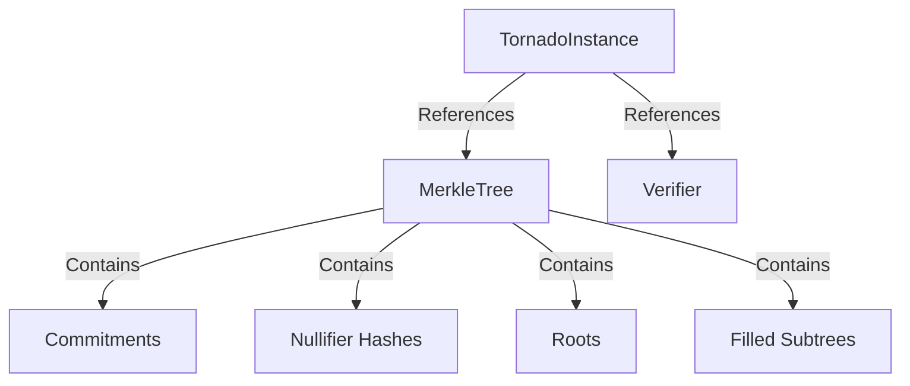

# Data Structures

This section provides detailed information about the data structures used in the Tornado Cash Privacy Solution for Solana.

## Core Data Structures

The system relies on several key data structures to provide privacy and security:

1. [Accounts](accounts.md): The Solana account structures used to store state
2. [Merkle Tree](merkle-tree.md): The data structure used to store commitments
3. [Nullifier Registry](nullifier-registry.md): The data structure used to prevent double-spending
4. [Commitment Registry](commitment-registry.md): The data structure used to store commitments

## Data Structure Interactions

The data structures interact with each other to provide the complete privacy solution:

## Performance Considerations

The data structures are optimized for Solana's performance characteristics:

1. **Compute Units**: Operations on the data structures are optimized to minimize compute unit usage
2. **Account Storage**: The data structures are designed to minimize account storage costs
3. **Parallelization**: The data structures leverage Solana's parallel transaction processing

## Security Considerations

The security of the system relies on the security of these data structures:

1. **Merkle Tree**: Provides efficient and secure storage of commitments
2. **Nullifier Registry**: Prevents double-spending of commitments
3. **Commitment Registry**: Ensures the security of deposits
4. **Account Structure**: Ensures secure storage and access control