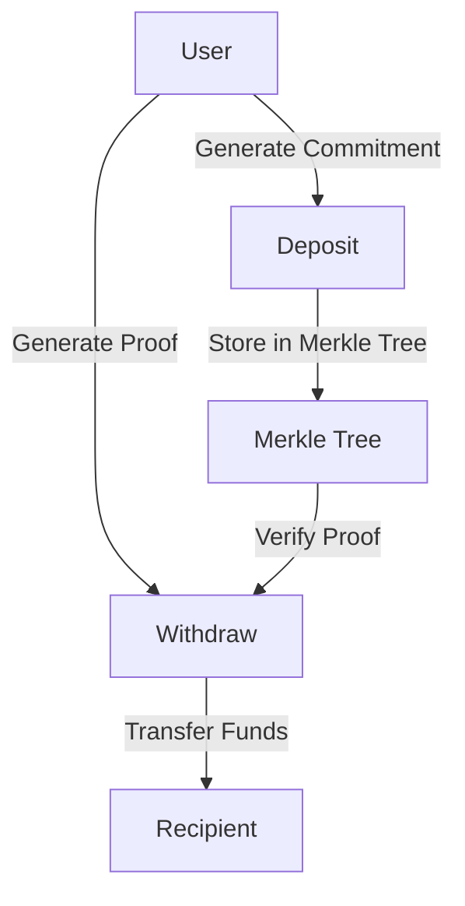

# Tornado Cash Privacy Solution for Solana

Welcome to the documentation for the Solana implementation of Tornado Cash, a privacy solution based on zkSNARKs. This documentation provides comprehensive information about the architecture, algorithms, data structures, and usage of the Tornado Cash Privacy Solution for Solana.

## Overview

Tornado Cash for Solana is a privacy solution that improves transaction privacy by breaking the on-chain link between sender and recipient addresses. It uses a Solana program that accepts SOL deposits that can be withdrawn by a different address. Whenever SOL is withdrawn by the new address, there is no way to link the withdrawal to the deposit, ensuring complete privacy.

## How It Works

The basic flow of the Tornado Cash Privacy Solution is as follows:

1. **Deposit**: A user generates a secret and sends its hash (called a commitment) along with the deposit amount to the Tornado program. The program accepts the deposit and adds the commitment to its Merkle tree of deposits.

2. **Withdraw**: Later, the user decides to make a withdrawal. To do that, the user provides a zkSNARK proof that they possess a secret to an unspent commitment from the program's Merkle tree. The zkSNARK technology allows this to happen without revealing which exact deposit corresponds to this secret. The program checks the proof and transfers the deposited funds to the address specified for withdrawal.

## Features

- **Privacy**: Breaks the on-chain link between sender and recipient addresses
- **Non-custodial**: Users maintain control of their funds at all times
- **Optimized for Solana**: Designed to be efficient with Solana's compute units
- **Relayer support**: Allows third-party relayers to pay for gas fees
- **Multiple denominations**: Supports different deposit amounts

## Documentation Sections

- [Architecture](architecture.md): Overview of the system architecture
- [Algorithms](algorithms/index.md): Detailed explanation of the algorithms used
- [Data Structures](data-structures/index.md): Information about the data structures
- [Usage Guide](usage/index.md): How to use the Tornado Cash Privacy Solution
- [API Reference](api/index.md): Reference documentation for the API
- [Development Guide](development/index.md): Guide for developers

## Getting Started

To get started with the Tornado Cash Privacy Solution for Solana, check out the [Quick Start Guide](usage/quick-start.md).