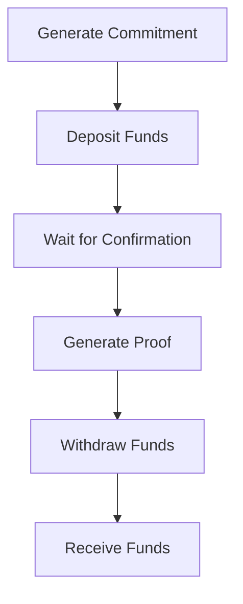

# Usage Guide

This section provides detailed information about how to use the Tornado Cash Privacy Solution for Solana. It covers installation, setup, and usage of the CLI tool.

## Getting Started

To get started with the Tornado Cash Privacy Solution for Solana, you'll need to:

1. [Install the CLI tool](installation.md)
2. [Set up a Solana wallet](wallet-setup.md)
3. [Deploy the Tornado Cash program](deployment.md)

## Basic Usage

The basic usage flow is as follows:

1. [Generate a commitment](quick-start.md#generate-a-commitment)
2. [Deposit funds](quick-start.md#deposit-funds)
3. [Generate a proof](quick-start.md#generate-a-proof)
4. [Withdraw funds](quick-start.md#withdraw-funds)

## Advanced Usage

For advanced usage, see:

1. [Using relayers](advanced/relayers.md)
2. [Multiple denominations](advanced/denominations.md)
3. [Custom Merkle tree heights](advanced/merkle-tree-heights.md)

## CLI Reference

For a complete reference of the CLI commands, see:

1. [generate-commitment](cli/generate-commitment.md)
2. [initialize](cli/initialize.md)
3. [deposit](cli/deposit.md)
4. [generate-proof](cli/generate-proof.md)
5. [withdraw](cli/withdraw.md)

## Troubleshooting

For help with common issues, see:

1. [Common errors](troubleshooting/common-errors.md)
2. [Debugging tips](troubleshooting/debugging.md)